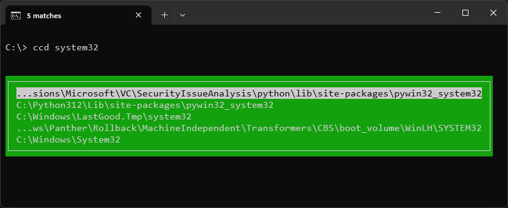
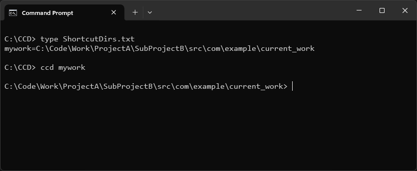

# Cursorial CD

Cursorial CD, or `ccd` for short, is a `cd` replacement for Window's cmd shell.  Unlike `cd`, it operates on an edge first search, so you can quickly drill down to the directory you're after:


If there are multiple matches for a directory you enter, it presents a small TUI based to select the correct directory:



You can also create some shortcut keywords to jump to a directory you need to often go to with a memorable keyword:



Run `ccd /?` to see a full list of options:

```

  Cursorial Change Directory

    Usage: ccd "partial directory name"

  .. = Go up one level (... for two levels, etc)
  -c = Create ccd helper batch files for .., ..., etc
  -f = Don't use smart directory matching
  -n = Don't change folder, just show matches
  -r = Force a rescan of all directories
  -s = Show stats about the AllDirs.db file
  -u = Only consider directories under this one

    Data files:

  AllDirs.db       = Database of all dirs, created during a "-r" scan
  IgnoreDirs.txt   = Directories to ignore during a "-r" scan
  ShortcutDirs.txt = Each line contains a shortcut of the 
                     format "shortcut=fullpath"

    Data directory:
    
  The first directory found of the following list will be used to
  store data files for the current drive:
  
    "C:\Users\scott\AppData\Local\CCD\C"
    "C:\CCD"
    "C:\"

  Any characters pressed during the display of potential directories
  will be used to filter the list.

    Build 38, created by Scott Seligman
              <scott@scottandmichelle.net>

```
